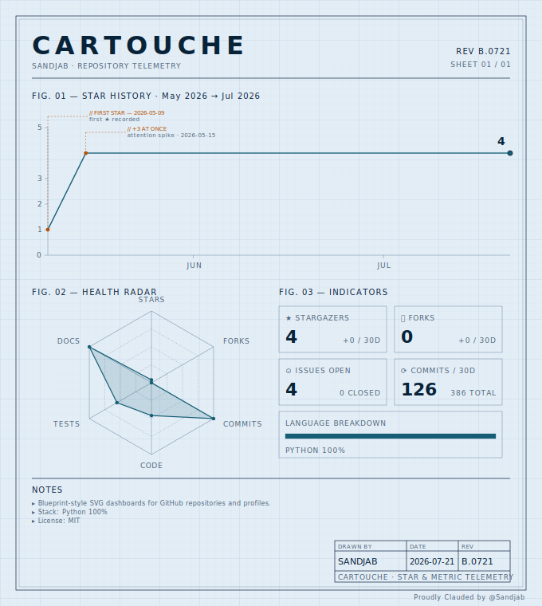

# Cartouche

> 🇬🇧 **English** (you are here) · 🇫🇷 [Français](README-fr.md)

> Blueprint-style SVG dashboards for GitHub repositories and profiles.
> Pure SVG primitives, six themes, two languages, embeddable in any README via `<picture>`.

<picture>
  <source media="(prefers-color-scheme: dark)" srcset="assets/dashboard-dark.svg">
  
</picture>

Cartouche takes a GitHub repo (or a whole profile) and renders it as a
technical-drawing SVG: grid, double-line frame, annotated star history,
health radar, key metrics, and a *cartouche* — the architectural title
block — in the bottom-right corner. Six themes (light + dark), two
built-in languages (English + French) with extensible custom packs via
JSON, all served through the `<picture>` tag for both color modes.

```
┌──────────────────────────────────────────────────────────┐
│  ATHANOR                                  REV A.04       │
│  SANDJAB · REPOSITORY TELEMETRY           SHEET 01 / 01  │
│  ────────────────────────────────────────────────────    │
│  FIG. 01 — STAR HISTORY · Sep 2025 → May 2026            │
│       ╱──•                                               │
│      ╱   // FIRST STAR — 2025-10-08                      │
│   ──╯                                                    │
│  ────────────────────────────────────────────────────    │
│  FIG. 02 — HEALTH RADAR    FIG. 03 — INDICATORS          │
│      ☆                  ┌────┐ ┌────┐                    │
│   ◇  ●  ◇               │ 23 │ │  4 │                    │
│      ◇                  └────┘ └────┘                    │
│                         ┌────┐ ┌────┐                    │
│                         │ 12 │ │ 67 │                    │
│                         └────┘ └────┘                    │
│  ────────────────────────────────────────────────────    │
│  NOTES                              ┌────────────────┐   │
│  ▸ Pipeline: atomic claims …        │ SANDJAB │ A.04 │   │
│  ▸ Canonical docs: CLAUDE.md …      └────────────────┘   │
└──────────────────────────────────────────────────────────┘
```

## Why

Existing solutions (star-history.com, GitHub Charts, etc.) serve images
through GitHub's Camo proxy, which means aggressive caching, occasional
refresh failures, and zero control over the rendering. Cartouche makes
the opposite tradeoff: generate the SVG locally via a GitHub Action,
commit it to your repo, and serve it as a versioned file — so it
refreshes on the cron cadence you set, is readable by anyone, and is
fully styleable to taste.

## Installation

```bash
pip install cartouche-svg
```

Zero runtime dependencies — Cartouche uses only the standard library
(`urllib` for API calls, `json`, `datetime`, `math`, `importlib.resources`).

## CLI usage

```bash
# Repo dashboard (English by default)
cartouche repo Sandjab/Athanor --theme blueprint-light --out dashboard.svg

# Same dashboard in French
cartouche repo Sandjab/Athanor --theme blueprint-light --lang fr --out dashboard.svg

# Profile dashboard
cartouche profile Sandjab --theme drafting-dark --out profile.svg

# List available themes and languages
cartouche themes
cartouche langs

# Test layouts without hitting the API (canned data)
cartouche repo Sandjab/Athanor --mock --theme vellum-light

# Override individual labels with your own JSON pack
cartouche repo Sandjab/Athanor --lang fr --lang-file ./my-overrides.json
```

Token resolution: `--token` > `$GITHUB_TOKEN` > `$GH_TOKEN` > anonymous
(60 req/h, rarely enough for a profile).

## Internationalization

**English by default.** Switch to French with `--lang fr`.

### Built-in packs

```bash
cartouche langs   # → en, fr
```

### Adding a language

Drop a `<code>.json` file into `src/cartouche/lang/`, mirroring the schema
of `en.json` (keys: `labels`, `templates`, `months_short`, `months_long`).
The `test_lang_has_all_required_keys` test will tell you which keys are
mandatory. Once dropped and the wheel rebuilt, `--lang <code>` works
out of the box.

### Overriding without recompiling

To tweak a few strings ad-hoc without publishing a new pack, write a JSON
overlay and pass it via `--lang-file`:

```json
{
  "labels": {
    "fig_radar_health": "FIG. 02 — VITAL SIGNS",
    "drawn_by": "BY"
  },
  "templates": {
    "n_years": "{n} years"
  }
}
```

```bash
cartouche repo Sandjab/Athanor --lang en --lang-file my-overrides.json --out dashboard.svg
```

The overlay is *deep-merged* on top of the base pack: only the keys you
specify are replaced, everything else stays intact.

### Language pack schema

```json
{
  "code": "xx",
  "name": "My language",
  "labels": {
    "drawn_by": "...",
    "fig_radar_health": "...",
    "card_stargazers": "...",
    ...
  },
  "templates": {
    "fig_star_history": "FIG. 01 — STAR HISTORY · {start} → {end}",
    "first_star_top": "// FIRST STAR — {date}",
    ...
  },
  "months_short": ["JAN", "FEB", ...],
  "months_long":  ["Jan", "Feb", ...]
}
```

See `src/cartouche/lang/en.json` for the full key list.

## Themes

Six themes in three families, each with a light and a dark counterpart.

| Family       | Light                 | Dark                |
|--------------|-----------------------|---------------------|
| **Drafting** | `drafting-light`      | `drafting-dark`     |
| **Blueprint**| `blueprint-light`     | `blueprint-dark`    |
| **Vellum**   | `vellum-light`        | `vellum-dark`       |

- **Drafting** — white paper, indigo ink. Achromatic, neutral, the tone
  of a technical memo.
- **Blueprint** — cyanotype lineage. Pale faded blue or a deep nighttime
  Prussian blue dive.
- **Vellum** — cream parchment / sepia. Dark variant: aged leather and
  gold. For those who want a Beaux-Arts feel rather than engineering.

## Embedding in a README

Serve the right variant based on the visitor's `prefers-color-scheme`:

```markdown
<picture>
  <source media="(prefers-color-scheme: dark)" srcset="assets/dashboard-dark.svg">
  
</picture>
```

Important: use a **relative path** (`assets/...`), not an absolute URL.
GitHub rewrites external images through its Camo proxy, which breaks the
`<picture>` light/dark mechanism; relative paths are served as-is.

## Auto-update via GitHub Actions

Two ready-to-use workflows live in `examples/workflows/`:

- `repo-dashboard.yml` — drop into `.github/workflows/` of the repo whose
  dashboard you want. Regenerates and commits every 6 hours.
- `profile-dashboard.yml` — drop into your **profile repo**
  (`<handle>/<handle>`). Twice a day.

Both use `secrets.GITHUB_TOKEN` (already available in any Action) and
work with no further configuration. To serve a French dashboard, add
`--lang fr` to the `cartouche` commands in the workflow.

## Python API

```python
from cartouche import lang
from cartouche.render import repo
from cartouche.themes import get_theme

# Load a language pack (with optional overlay)
fr = lang.load("fr", overlay_path="my-overrides.json")  # overlay optional

# Load data (mock or via fetch.repo_data())
from cartouche.mock import mock_repo
data = mock_repo("Sandjab", "Athanor", lang=fr)

# Render the SVG
svg = repo.render(data, theme=get_theme("vellum-light"), lang=fr)
```

## Architecture

```
src/cartouche/
├── themes.py            # 6-theme registry (dict-of-dicts)
├── lang/
│   ├── __init__.py      # load(), list_builtin(), t(), tmpl()
│   ├── en.json          # default language
│   └── fr.json          # French
├── fetch.py             # GitHub REST + GraphQL wrappers, stdlib only
├── mock.py              # canned fixtures for development without API
├── cli.py               # argparse entry point
└── render/
    ├── primitives.py    # frame, grid, cartouche, axes, radar, text
    ├── repo.py          # repo dashboard composer
    └── profile.py       # profile dashboard composer
```

The render engine is *token-agnostic* (colors come from `themes`) and
*literal-free* (strings come from `lang`). Adding a seventh theme = ~12
lines in `THEMES`. Adding a language = drop a JSON in `lang/`. See
[CLAUDE.md](CLAUDE.md) for the architectural invariants in detail.

## What gets displayed

### Repo dashboard

- **FIG. 01** — Star history with peak annotations and endpoint marker
- **FIG. 02** — 6-axis radar: stars, forks, commits, code, tests, docs
- **FIG. 03** — Cards: stargazers, forks, issues, commits/30d + language
  breakdown bar

### Profile dashboard

- **FIG. 01** — Cumulative stars across all the account's public repos
- **FIG. 02** — Top 5 repos by stars, with language and commits/30d
  (long names are truncated with `…` to keep them off the bars)
- **FIG. 03** — 6-axis profile radar: reach, activity, breadth, depth,
  polyglot, engagement
- **FIG. 04** — 53-week trailing contribution heatmap (via GraphQL —
  requires a token)
- **FIG. 05** — Indicators: total stars, total forks, commits/12 months,
  account age

Both dashboards carry a small `Proudly Clauded by @<handle>` watermark
just below the frame, in the bottom-right corner. The handle is pulled
from the data, so anyone running the lib gets their own credit line
automatically. To remove or rephrase it, override the `proudly_clauded`
template via `--lang-file`.

## Known limitations

- The profile dashboard hits `/repos/.../stargazers` for each public
  repo; for an account with many highly-starred repos, this can take a
  minute. An incremental cache layer is planned.
- Forks are excluded from profile aggregates (filtered out). The
  dashboard for an individual fork still works normally.
- Web fonts are not embedded — GitHub strips them when rendering SVGs in
  READMEs. The fallback is a system monospace stack.
- Annotations are auto-detected (first ★, biggest spike); custom callouts
  aren't exposed yet.

## Development

```bash
git clone https://github.com/Sandjab/cartouche
cd cartouche
pip install -e ".[dev]"
pytest                                                 # 55 tests, ~0.2s
python -m cartouche repo Sandjab/Athanor --mock        # smoke test without API
python -m cartouche profile Sandjab --mock --lang fr   # FR variant
```

For Claude Code CLI: see [CLAUDE.md](CLAUDE.md) for architecture,
invariants, and common tasks.

## License

MIT — see [LICENSE](LICENSE).
