# Cartouche Theme Catalogue

Sixteen themes in eight aesthetic families: five clean palettes (Drafting,
Blueprint, Vellum, Botanical, Blossom) plus three watermarked variants
(Vellum + Davinci, Botanical + Floral, Blossom + Kawai). Every preview
below is rendered from the **same mock fixtures** (`mock_repo()` and
`mock_profile()`) so the only thing changing between two cells is the
palette and the watermark. Pick a theme via `--theme <name>` on the CLI
or `get_theme(<name>)` in the Python API.

```bash
cartouche themes  # list all sixteen
cartouche repo    Sandjab/Athanor --mock --theme vellum-davinci-dark    --out /tmp/r.svg
cartouche profile Sandjab          --mock --theme blossom-kawai-light --out /tmp/p.svg
```

| Family               | Light                       | Dark                       |
|----------------------|-----------------------------|----------------------------|
| **Drafting**         | `drafting-light`            | `drafting-dark`            |
| **Blueprint**        | `blueprint-light`           | `blueprint-dark`           |
| **Vellum**           | `vellum-light`              | `vellum-dark`              |
| **Botanical**        | `botanical-light`           | `botanical-dark`           |
| **Blossom**          | `blossom-light`             | `blossom-dark`             |
| **Vellum + Davinci** | `vellum-davinci-light`      | `vellum-davinci-dark`      |
| **Botanical + Floral** | `botanical-floral-light`  | `botanical-floral-dark`    |
| **Blossom + Kawai**  | `blossom-kawai-light`       | `blossom-kawai-dark`       |

---

## Drafting

White paper, indigo ink. **Achromatic, neutral, the tone of a technical
memo** — it disappears into a documentation page rather than calling
attention to itself. The dark variant flips to charcoal paper without
shifting the underlying hue family. Pick this when the dashboard sits next
to body copy and shouldn't fight for attention.

### Repo dashboard

| `drafting-light` | `drafting-dark` |
|---|---|
| <a href="https://cdn.jsdelivr.net/gh/Sandjab/cartouche@main/examples/outputs/repo-drafting-light.svg" target="_blank" rel="noopener">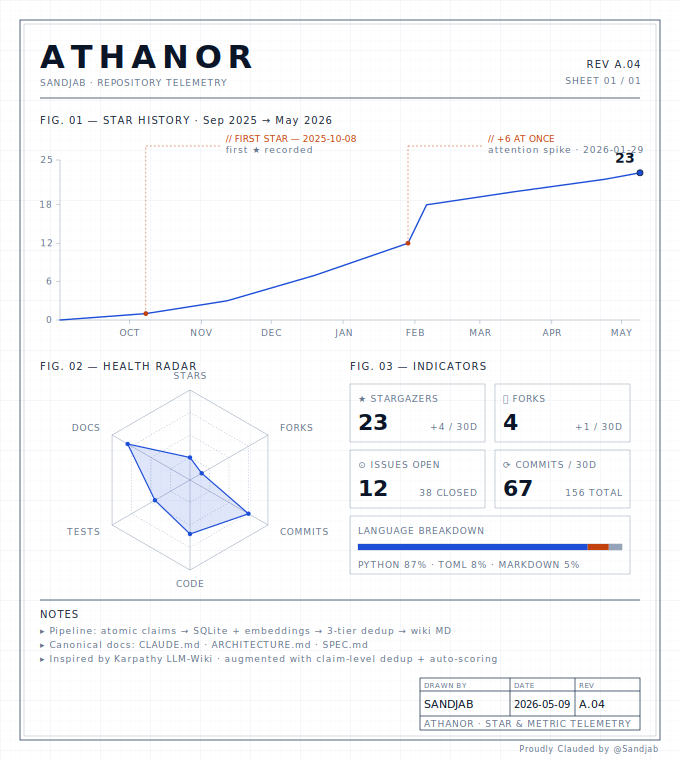</a> | <a href="https://cdn.jsdelivr.net/gh/Sandjab/cartouche@main/examples/outputs/repo-drafting-dark.svg" target="_blank" rel="noopener">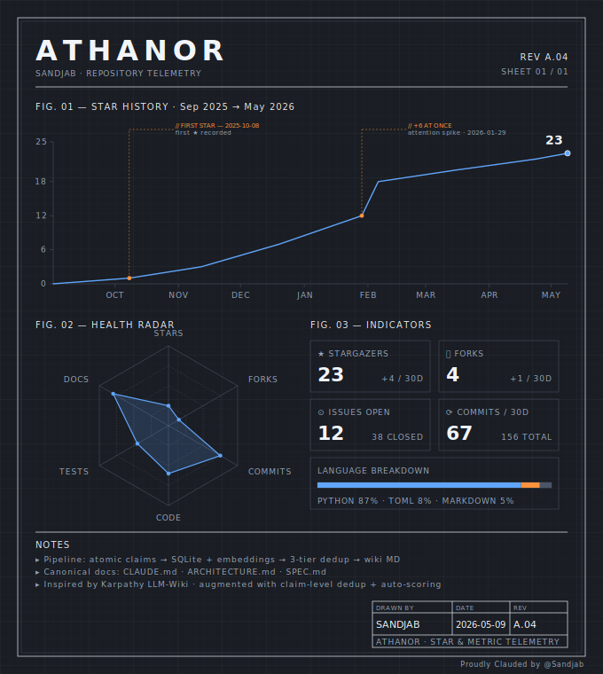</a> |

### Profile dashboard

| `drafting-light` | `drafting-dark` |
|---|---|
| <a href="https://cdn.jsdelivr.net/gh/Sandjab/cartouche@main/examples/outputs/profile-drafting-light.svg" target="_blank" rel="noopener">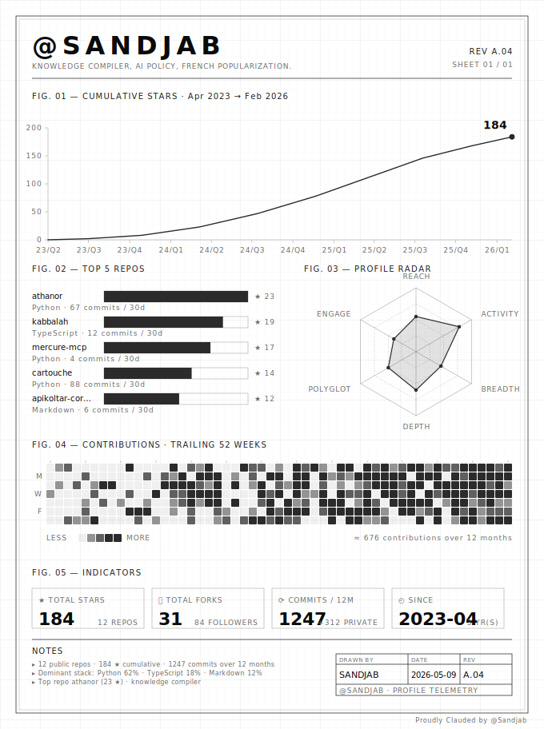</a> | <a href="https://cdn.jsdelivr.net/gh/Sandjab/cartouche@main/examples/outputs/profile-drafting-dark.svg" target="_blank" rel="noopener">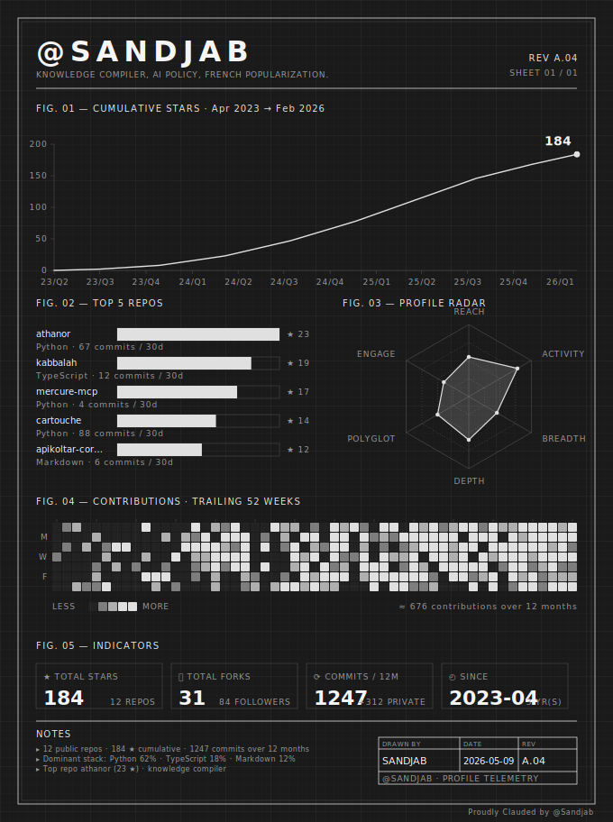</a> |

---

## Blueprint

Cyanotype lineage. The **pale faded reverse** of an architectural blueprint
on the light side, and a **deep nighttime Prussian blue dive** on the dark
side — the most "engineering-drawing"-coded of the five base families,
and the default theme for the CLI. Reach for this when you want the
dashboard to read instantly as a technical artefact.

### Repo dashboard

| `blueprint-light` | `blueprint-dark` |
|---|---|
| <a href="https://cdn.jsdelivr.net/gh/Sandjab/cartouche@main/examples/outputs/repo-blueprint-light.svg" target="_blank" rel="noopener">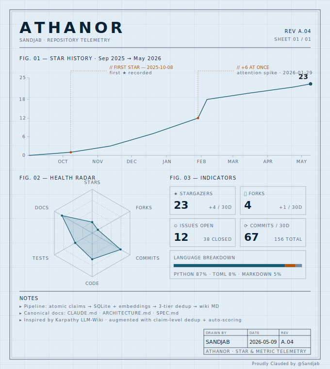</a> | <a href="https://cdn.jsdelivr.net/gh/Sandjab/cartouche@main/examples/outputs/repo-blueprint-dark.svg" target="_blank" rel="noopener">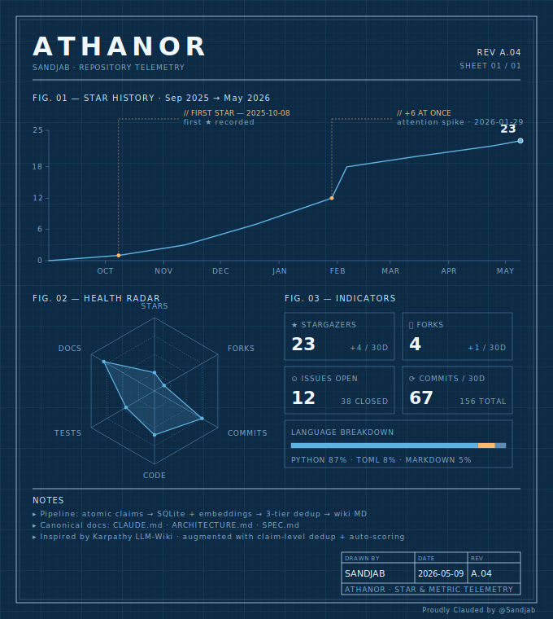</a> |

### Profile dashboard

| `blueprint-light` | `blueprint-dark` |
|---|---|
| <a href="https://cdn.jsdelivr.net/gh/Sandjab/cartouche@main/examples/outputs/profile-blueprint-light.svg" target="_blank" rel="noopener">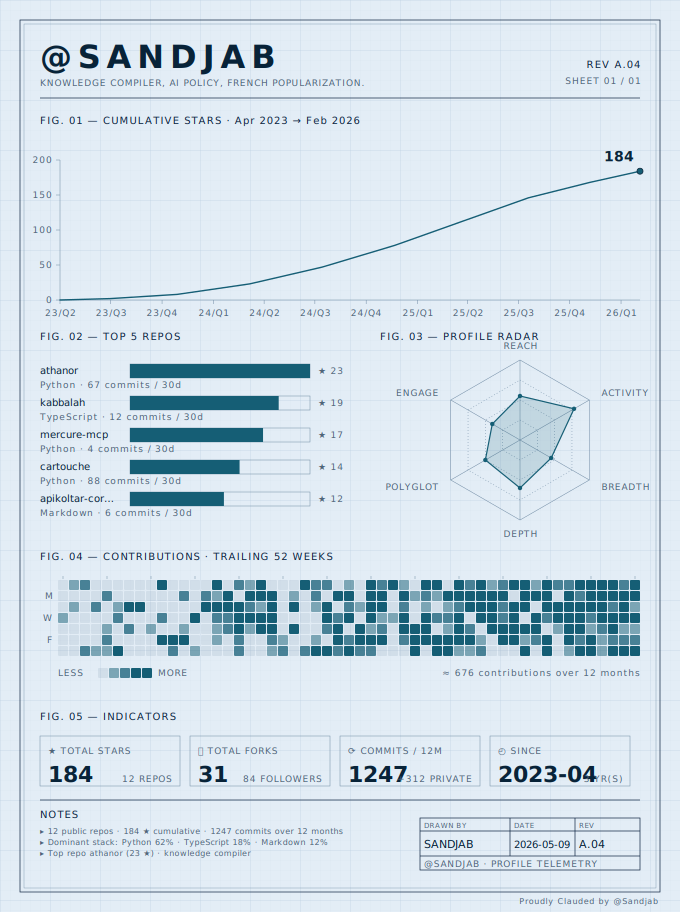</a> | <a href="https://cdn.jsdelivr.net/gh/Sandjab/cartouche@main/examples/outputs/profile-blueprint-dark.svg" target="_blank" rel="noopener">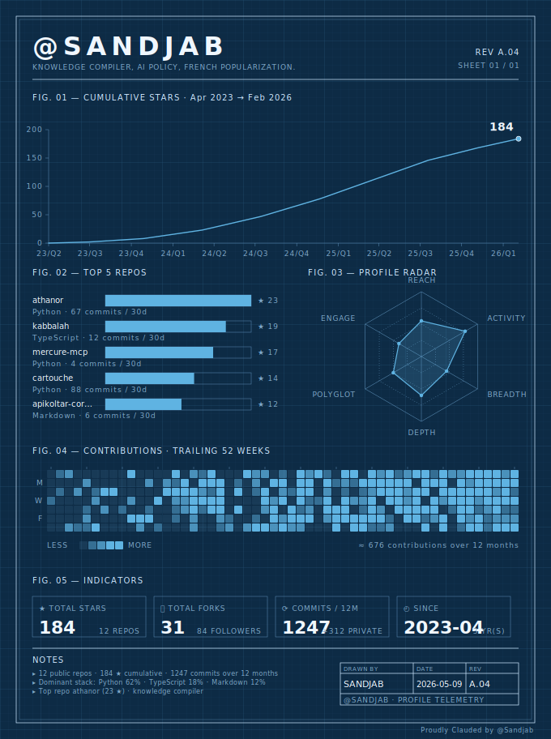</a> |

---

## Vellum

Cream parchment with sepia ink on the light side; aged leather and gold leaf
on the dark side. **A Beaux-Arts feel rather than engineering** — closer to
a 19th-century naturalist plate than to a Bauhaus blueprint. Use this when
the surrounding context is editorial, hand-crafted, or deliberately
nostalgic; it makes the data feel curated rather than instrumented.

### Repo dashboard

| `vellum-light` | `vellum-dark` |
|---|---|
| <a href="https://cdn.jsdelivr.net/gh/Sandjab/cartouche@main/examples/outputs/repo-vellum-light.svg" target="_blank" rel="noopener">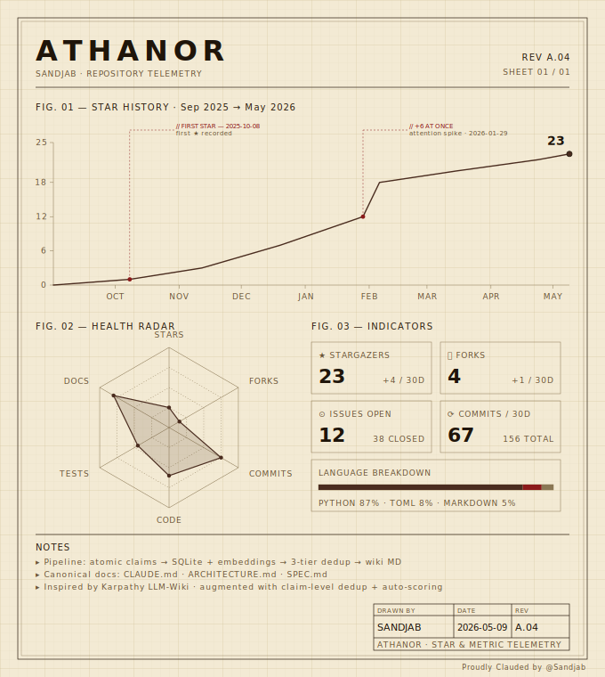</a> | <a href="https://cdn.jsdelivr.net/gh/Sandjab/cartouche@main/examples/outputs/repo-vellum-dark.svg" target="_blank" rel="noopener">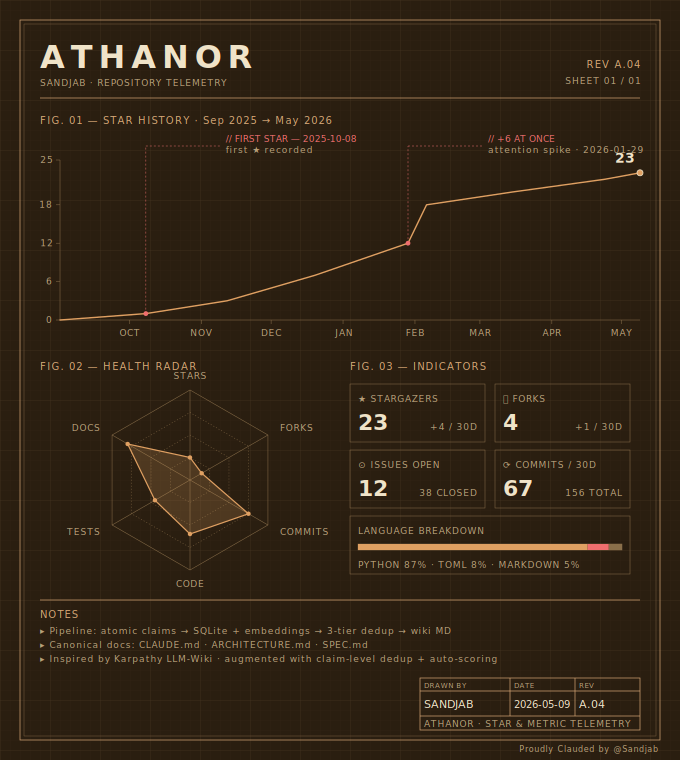</a> |

### Profile dashboard

| `vellum-light` | `vellum-dark` |
|---|---|
| <a href="https://cdn.jsdelivr.net/gh/Sandjab/cartouche@main/examples/outputs/profile-vellum-light.svg" target="_blank" rel="noopener">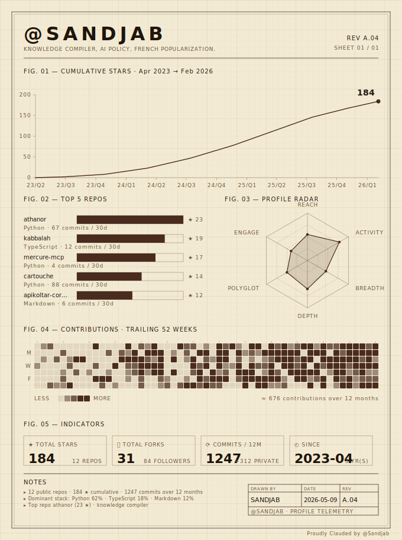</a> | <a href="https://cdn.jsdelivr.net/gh/Sandjab/cartouche@main/examples/outputs/profile-vellum-dark.svg" target="_blank" rel="noopener">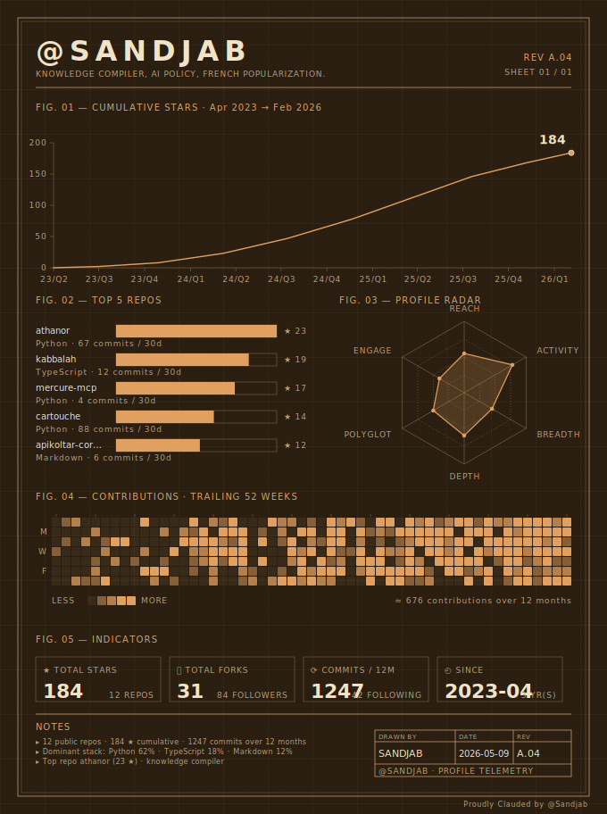</a> |

---

## Botanical

19th-century herbarium plate. **Sage-and-fern ink on ivory paper** on the
light side; **deep forest at night** with candle-pollen amber accents on
the dark side. Reach for this when the dashboard sits next to long-form
scientific or naturalist content — it makes the data feel observed and
catalogued rather than instrumented and measured.

### Repo dashboard

| `botanical-light` | `botanical-dark` |
|---|---|
| <a href="https://cdn.jsdelivr.net/gh/Sandjab/cartouche@main/examples/outputs/repo-botanical-light.svg" target="_blank" rel="noopener">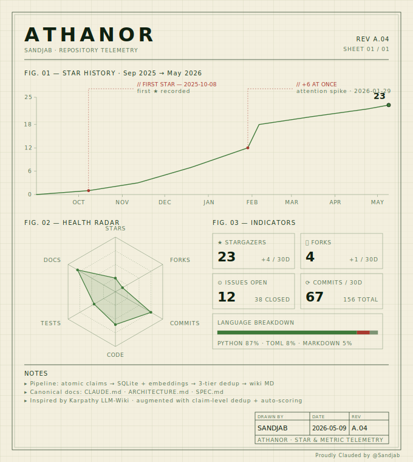</a> | <a href="https://cdn.jsdelivr.net/gh/Sandjab/cartouche@main/examples/outputs/repo-botanical-dark.svg" target="_blank" rel="noopener">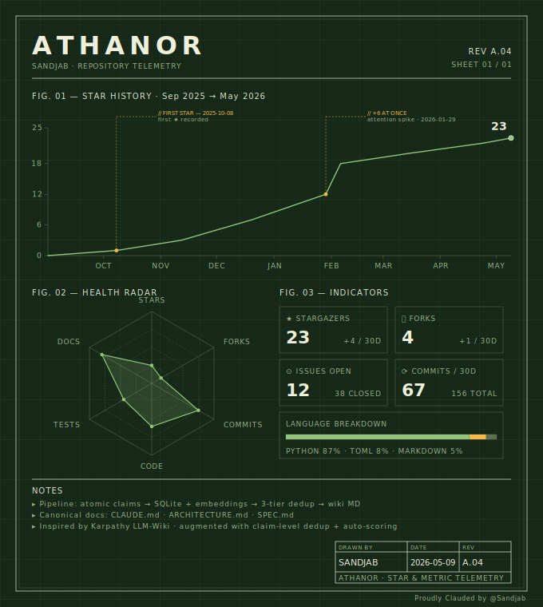</a> |

### Profile dashboard

| `botanical-light` | `botanical-dark` |
|---|---|
| <a href="https://cdn.jsdelivr.net/gh/Sandjab/cartouche@main/examples/outputs/profile-botanical-light.svg" target="_blank" rel="noopener">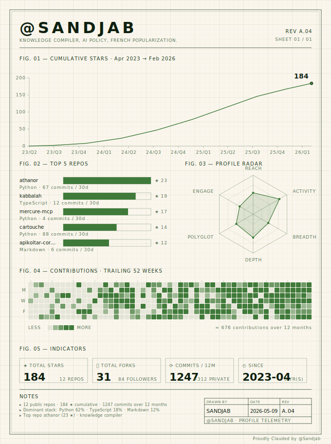</a> | <a href="https://cdn.jsdelivr.net/gh/Sandjab/cartouche@main/examples/outputs/profile-botanical-dark.svg" target="_blank" rel="noopener">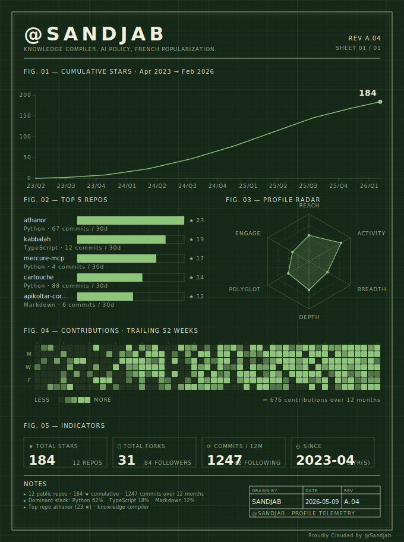</a> |

---

## Blossom

Sakura kawaii. **Powder-rose ink on ivory with pearl-grey structure** on
the light side; **deep aubergine boudoir at night** with neon-soft pink
data and mint complement accents on the dark side. The most explicitly
girly of the bunch — pick this when the dashboard belongs to a personal
project that should read as joyful and crafted rather than industrial.

### Repo dashboard

| `blossom-light` | `blossom-dark` |
|---|---|
| <a href="https://cdn.jsdelivr.net/gh/Sandjab/cartouche@main/examples/outputs/repo-blossom-light.svg" target="_blank" rel="noopener">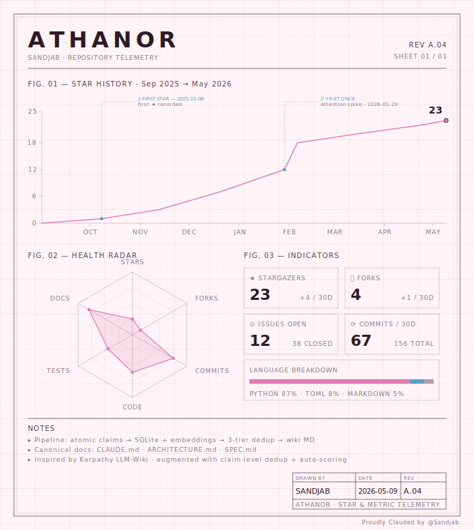</a> | <a href="https://cdn.jsdelivr.net/gh/Sandjab/cartouche@main/examples/outputs/repo-blossom-dark.svg" target="_blank" rel="noopener">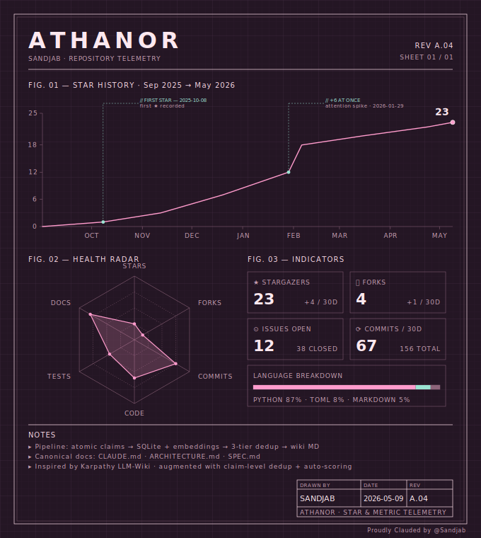</a> |

### Profile dashboard

| `blossom-light` | `blossom-dark` |
|---|---|
| <a href="https://cdn.jsdelivr.net/gh/Sandjab/cartouche@main/examples/outputs/profile-blossom-light.svg" target="_blank" rel="noopener">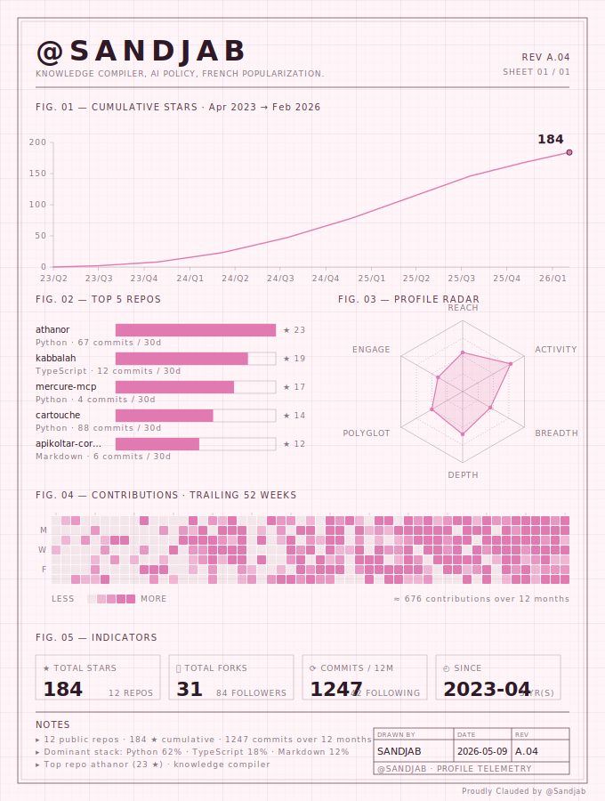</a> | <a href="https://cdn.jsdelivr.net/gh/Sandjab/cartouche@main/examples/outputs/profile-blossom-dark.svg" target="_blank" rel="noopener">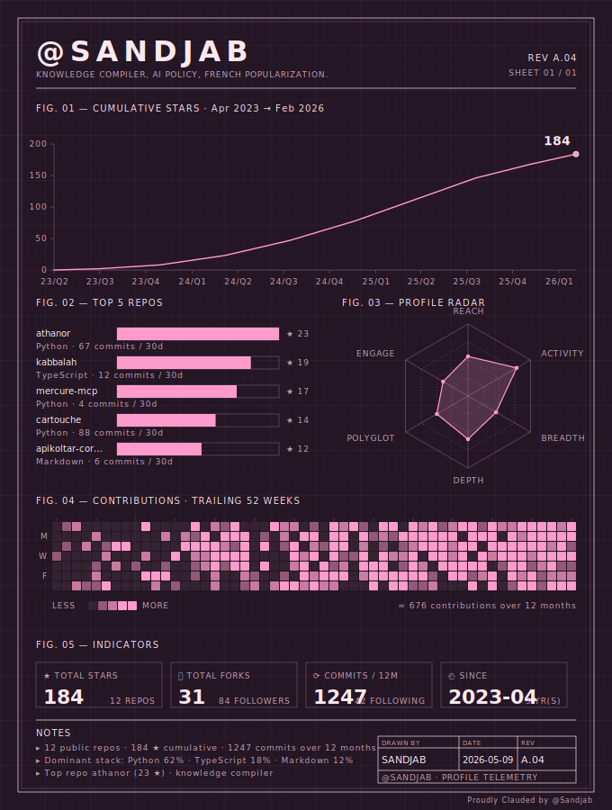</a> |

---

## Vellum + Davinci

Same Vellum palette as above, with a **bundled Da Vinci plate watermark**
inlined behind the data layer at low opacity. The Vitruvian Man feels
particularly at home here: the parchment ground reads as the surface of an
old codex, and the watermark bleeds through as an afterimage of the master
draftsman's notebook. Pair with editorial / archival content.

### Repo dashboard

| `vellum-davinci-light` | `vellum-davinci-dark` |
|---|---|
| <a href="https://cdn.jsdelivr.net/gh/Sandjab/cartouche@main/examples/outputs/repo-vellum-davinci-light.svg" target="_blank" rel="noopener">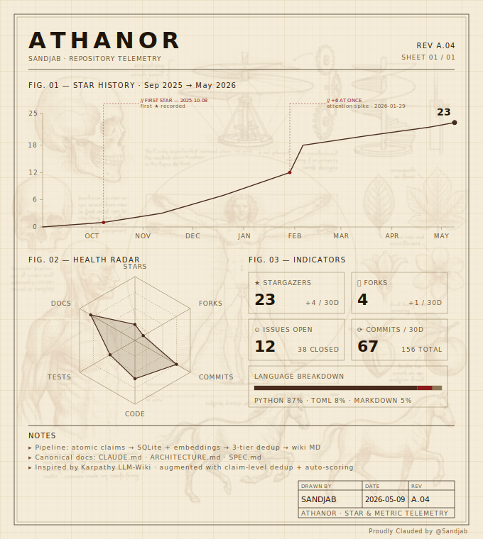</a> | <a href="https://cdn.jsdelivr.net/gh/Sandjab/cartouche@main/examples/outputs/repo-vellum-davinci-dark.svg" target="_blank" rel="noopener">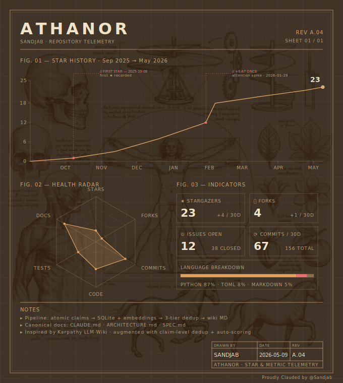</a> |

### Profile dashboard

| `vellum-davinci-light` | `vellum-davinci-dark` |
|---|---|
| <a href="https://cdn.jsdelivr.net/gh/Sandjab/cartouche@main/examples/outputs/profile-vellum-davinci-light.svg" target="_blank" rel="noopener">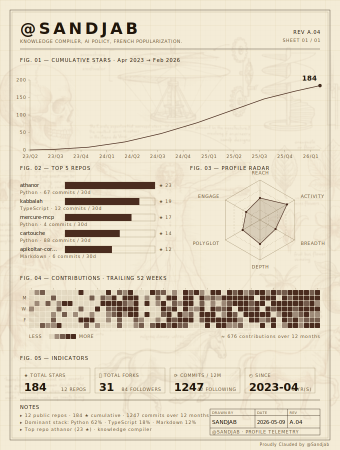</a> | <a href="https://cdn.jsdelivr.net/gh/Sandjab/cartouche@main/examples/outputs/profile-vellum-davinci-dark.svg" target="_blank" rel="noopener">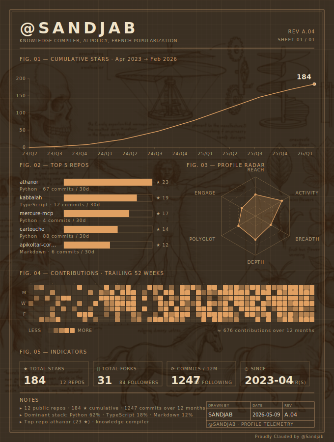</a> |

---

## Botanical + Floral

Botanical palette plus a **floral motif watermark** ghosted into the
background. Pushes the herbarium feel further: the paper now appears to be
printed on a wallpaper sheet, with the metrics sitting on top of a faint
flower bed. Best for projects that want a richly decorated background
without sacrificing legibility of the data layer.

### Repo dashboard

| `botanical-floral-light` | `botanical-floral-dark` |
|---|---|
| <a href="https://cdn.jsdelivr.net/gh/Sandjab/cartouche@main/examples/outputs/repo-botanical-floral-light.svg" target="_blank" rel="noopener">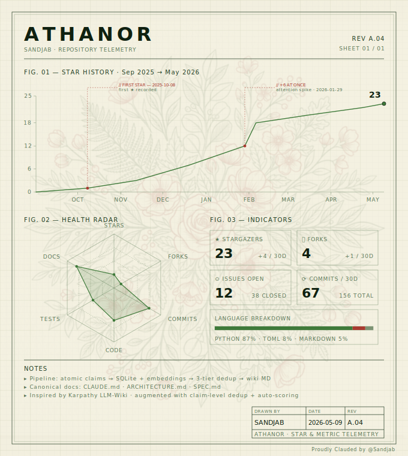</a> | <a href="https://cdn.jsdelivr.net/gh/Sandjab/cartouche@main/examples/outputs/repo-botanical-floral-dark.svg" target="_blank" rel="noopener">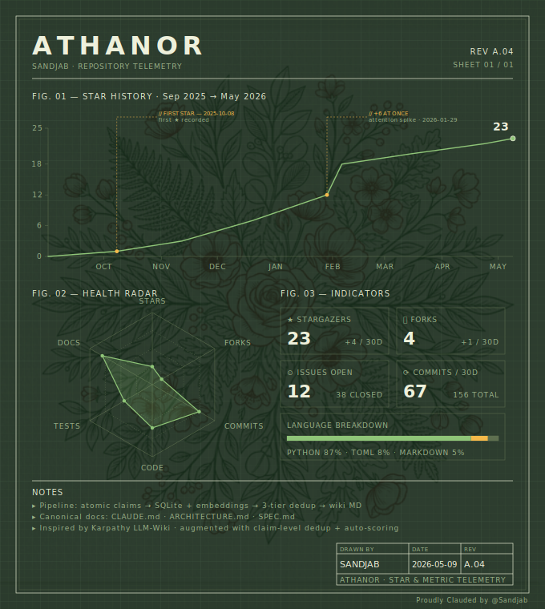</a> |

### Profile dashboard

| `botanical-floral-light` | `botanical-floral-dark` |
|---|---|
| <a href="https://cdn.jsdelivr.net/gh/Sandjab/cartouche@main/examples/outputs/profile-botanical-floral-light.svg" target="_blank" rel="noopener">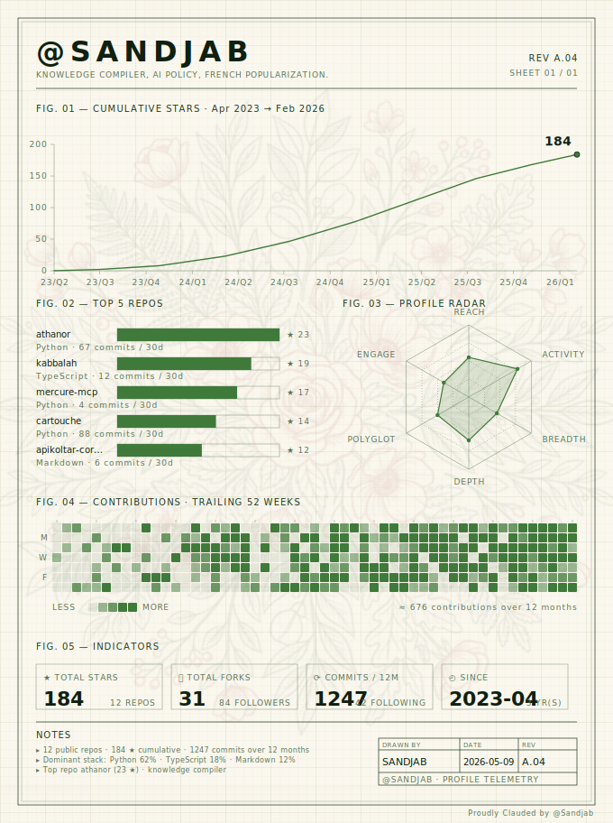</a> | <a href="https://cdn.jsdelivr.net/gh/Sandjab/cartouche@main/examples/outputs/profile-botanical-floral-dark.svg" target="_blank" rel="noopener">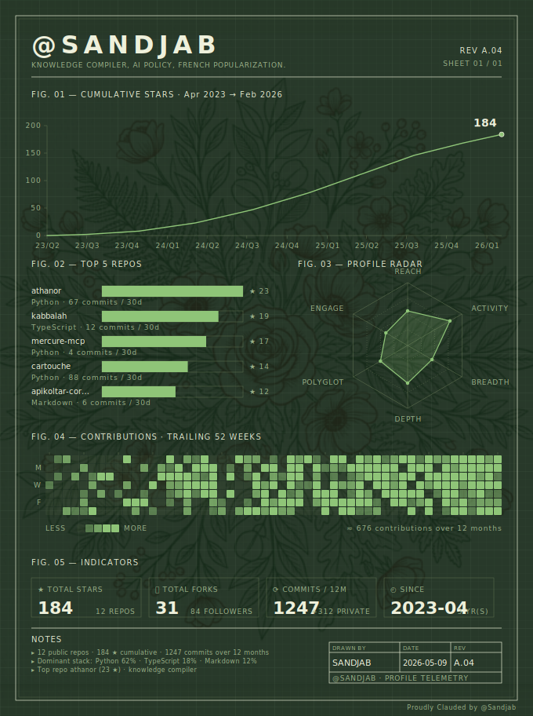</a> |

---

## Blossom + Kawai

Blossom palette plus a **kawaii character watermark**. The pink-grey paper
of Blossom now hosts a soft mascot ghosted under the cartouche grid — full
sakura-stationery vibe. Use this for personal pages that should feel
unapologetically cute, or for community/internal projects where the
dashboard doubles as decoration.

### Repo dashboard

| `blossom-kawai-light` | `blossom-kawai-dark` |
|---|---|
| <a href="https://cdn.jsdelivr.net/gh/Sandjab/cartouche@main/examples/outputs/repo-blossom-kawai-light.svg" target="_blank" rel="noopener">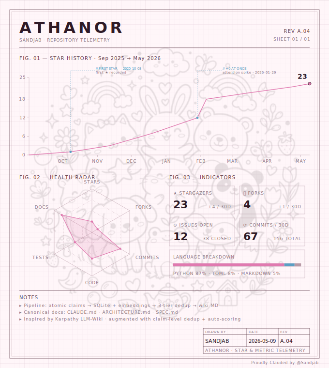</a> | <a href="https://cdn.jsdelivr.net/gh/Sandjab/cartouche@main/examples/outputs/repo-blossom-kawai-dark.svg" target="_blank" rel="noopener">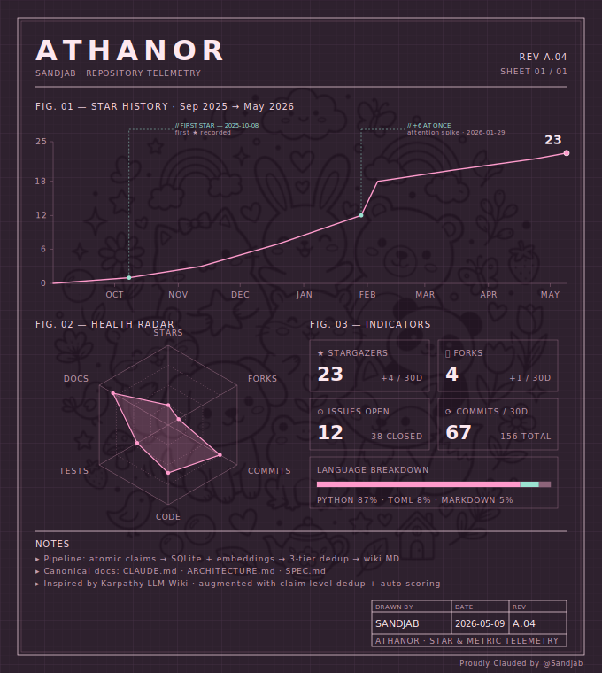</a> |

### Profile dashboard

| `blossom-kawai-light` | `blossom-kawai-dark` |
|---|---|
| <a href="https://cdn.jsdelivr.net/gh/Sandjab/cartouche@main/examples/outputs/profile-blossom-kawai-light.svg" target="_blank" rel="noopener">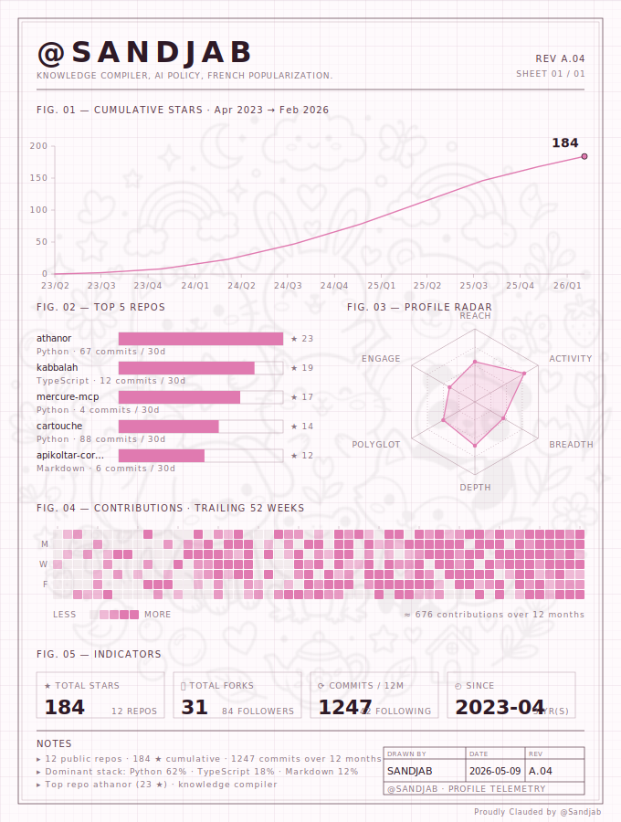</a> | <a href="https://cdn.jsdelivr.net/gh/Sandjab/cartouche@main/examples/outputs/profile-blossom-kawai-dark.svg" target="_blank" rel="noopener">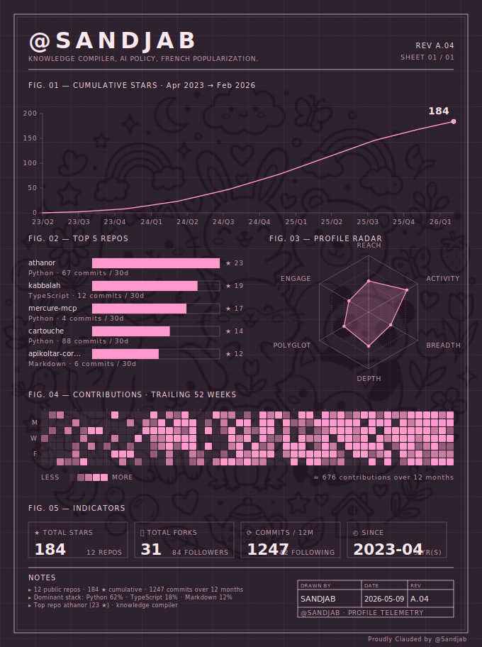</a> |

---

## How watermarks work

The watermark is a **bundled PNG inlined as a base64 data URI** in the SVG
output, so the result stays self-contained (no external fetches at view
time, no foreignObject, no JS — Cartouche's invariants stay green). It's
laid over the background and grid at low opacity (default `0.10`) and sits
behind the frame and data, so it reads as a paper texture rather than as
data.

To add your own watermark, drop a `<name>.png` into
`src/cartouche/watermarks/`, then either:

- **Bind it to a new theme** — copy a watermarked entry in `themes.py` and
  set `"watermark": "<name>"` plus any opacity tweak.
- **Layer it onto an existing theme via overlay** *(future, not yet
  exposed via CLI)* — pass an explicit theme override at the API level.

Watermarks should be **PNG with transparency** at modest resolution
(~600–800px on the longest side keeps the resulting SVG under 1 MB).

## Adding a theme

A theme is a flat dict of color tokens — see `src/cartouche/themes.py`
for the contract. Adding one is ~12 lines: copy an existing entry, change
the palette, and the rest of the code (renderer, CLI, tests) picks it up
automatically. To regenerate this catalogue's previews for a new theme:

```bash
for kind in repo profile; do
  for variant in light dark; do
    PYTHONPATH=src python3 -m cartouche $kind \
      $([ "$kind" = repo ] && echo "Sandjab/Athanor" || echo "Sandjab") \
      --mock --theme NEW-THEME-$variant \
      --out examples/outputs/$kind-NEW-THEME-$variant.svg
  done
done
```

Then add a section above following the same structure (paragraph + two
2-column tables, one per dashboard kind).
